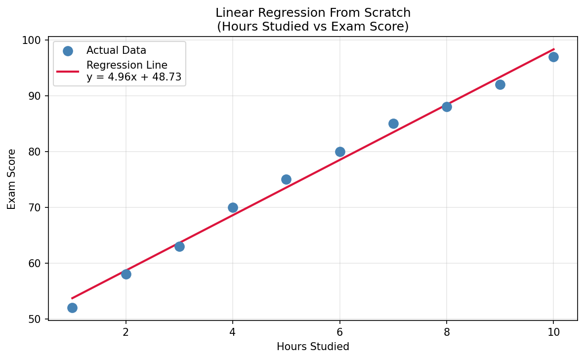
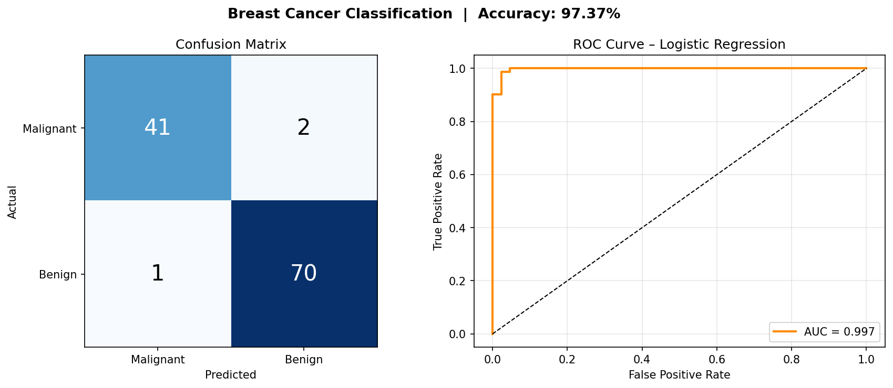

# Week 2 ML Projects - The Optimizers

## Project Title
Machine Learning Model Evaluation and Implementation

## Objective
Implement Linear Regression from scratch and build a Classification Model
for breast cancer detection as part of the Week 2 ML Internship Assignment.

---

## Tasks Covered
- Task 1: Model Evaluation (Accuracy, Precision, Recall, F1, AUC-ROC)
- Task 2: Linear Regression from Scratch using NumPy only
- Task 3: Breast Cancer Classification using Logistic Regression
- Task 4: Model Selection Strategy (Comparison Table)
- Task 5: Feature Importance and Explainable AI (SHAP)
- Task 6: GitHub Portfolio
- Task 7: Team Collaboration Reflection

---

## Dataset
- **Task 2:** Custom dataset — Hours Studied vs Exam Score (10 samples)
- **Task 3:** Breast Cancer Wisconsin Dataset (built into Scikit-Learn)
  - 569 samples, 30 features
  - Target: 0 = Malignant, 1 = Benign

---

## Technologies Used
| Tool | Purpose |
|------|---------|
| Python 3.10+ | Programming Language |
| NumPy | Mathematical computations (Linear Regression) |
| Matplotlib | Data visualisation and plots |
| Scikit-Learn | Dataset, model building, evaluation metrics |

---

## Files in This Repository
| File | Description |
|------|-------------|
| `linear_regression_scratch.py` | Linear Regression built from scratch using only NumPy |
| `classification_model.py` | Breast Cancer Classification using Logistic Regression |
| `lr_plot.png` | Output plot — Linear Regression line vs actual data |
| `classification_plot.png` | Confusion Matrix and ROC Curve output |
| `README.md` | Project documentation |

---

## Results
| Task | Model | Result |
|------|-------|--------|
| Task 2 | Linear Regression (Scratch) | MSE = 1.6352, Slope = 4.9576 |
| Task 3 | Logistic Regression | Accuracy = 97.37%, AUC-ROC = 0.9974 |

---

## How to Run the Project

### 1. Clone the repository
```bash
git clone https://github.com/YourUsername/Week2-ML-Projects-TheOptimizers
cd Week2-ML-Projects-TheOptimizers
```

### 2. Install dependencies
```bash
pip install numpy matplotlib scikit-learn
```

### 3. Run Linear Regression (Task 2)
```bash
python linear_regression_scratch.py
```

### 4. Run Classification Model (Task 3)
```bash
python classification_model.py
```

---

## Team
**Group Name:** The Optimizers

---

## Screenshots

### Linear Regression Output


### Classification Output (Confusion Matrix & ROC Curve)

